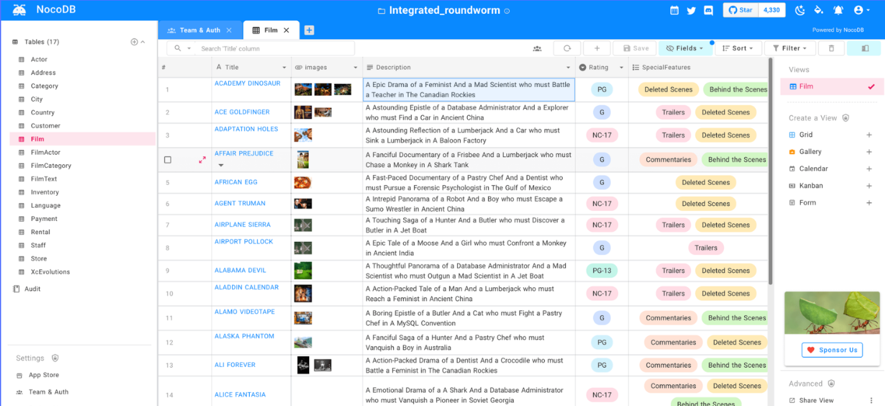

<!--
N.B.: This README was automatically generated by <https://github.com/YunoHost/apps/tree/master/tools/readme_generator>
It shall NOT be edited by hand.
-->

# NocoDB for YunoHost

[](https://ci-apps.yunohost.org/ci/apps/nocodb/)


[](https://install-app.yunohost.org/?app=nocodb)

*[Read this README in other languages.](./ALL_README.md)*

> *This package allows you to install NocoDB quickly and simply on a YunoHost server.*  
> *If you don't have YunoHost, please consult [the guide](https://yunohost.org/install) to learn how to install it.*

## Overview

NocoDB is an open source NoCode platform that turns any database into a smart spreadsheet, alternative to Airtable.

* Connect to new/existing SQL database and turn them into spreadsheet
* Create grid view, gallery view, kanban view and calendar view on top your data
* Search, sort, filter columns and rows with ultra ease
* Invite your team with fine grained Access Control
* Share views publicly and also with password protection
* Provides REST & GraphQL APIs with Swagger & GraphiQL GUI


**Shipped version:** 0.260.1~ynh1

**Demo:** <https://www.nocodb.com/demos>

## Screenshots



## Documentation and resources

- Official app website: <https://www.nocodb.com>
- Upstream app code repository: <https://github.com/nocodb/nocodb>
- YunoHost Store: <https://apps.yunohost.org/app/nocodb>
- Report a bug: <https://github.com/YunoHost-Apps/nocodb_ynh/issues>

## Developer info

Please send your pull request to the [`testing` branch](https://github.com/YunoHost-Apps/nocodb_ynh/tree/testing).

To try the `testing` branch, please proceed like that:

```bash
sudo yunohost app install https://github.com/YunoHost-Apps/nocodb_ynh/tree/testing --debug
or
sudo yunohost app upgrade nocodb -u https://github.com/YunoHost-Apps/nocodb_ynh/tree/testing --debug
```

**More info regarding app packaging:** <https://yunohost.org/packaging_apps>
